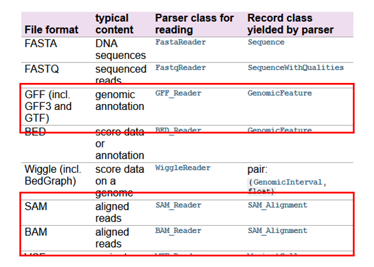
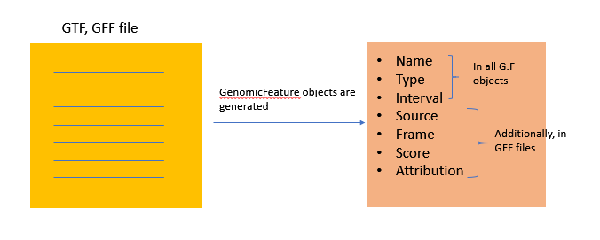
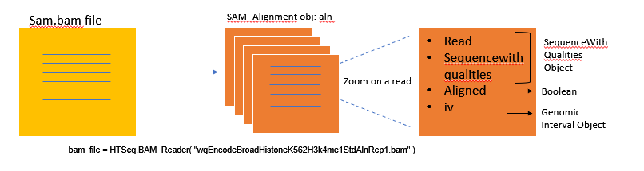
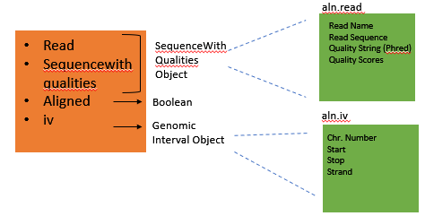
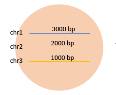
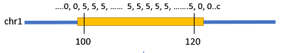
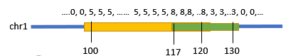
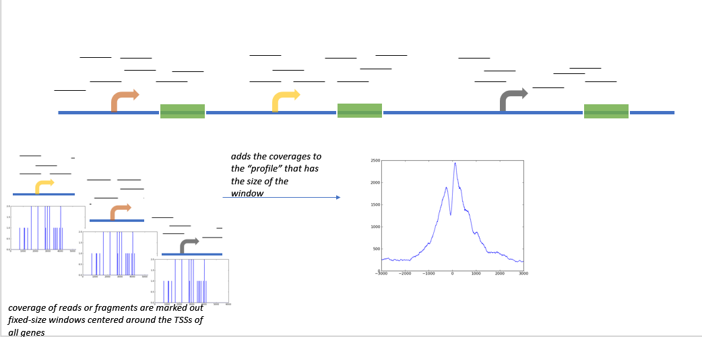

# HTSeq TSS Plot Tutorial #
## What is HTSeq? ##
HTseq is a python package that can perform a number of common analysis tasks.

1) **htseq-count**: counting reads (unix command)

2) **htseq-qa**: quality analysis of either raw or aligned reads (unix command)

3) Calculation of the coverage vector and exporting it for visualization in a genome browser.

4) Reading in annotation data from a GFF file

5) Assigning aligned reads from an RNA-Seq experiments to exons and genes.

6) TSS plot (integration of 3,4)


## Let's Start! ##

1. Copy the tutorial inside HPC: 
`$cp /cta/users/bata/HTSeq-Tutorial/ .`

2. Load HTSeq package to HPC:
`$module load htseq-0.11.2`

3. Open Python:
`$python`

`````
Python 3.7.3 (default, Mar 27 2019, 22:11:17)
[GCC 7.3.0] :: Anaconda, Inc. on linux
Type "help", "copyright", "credits" or "license" for more information.
``````
4. Import HTSeq package to python
`````
>>> import HTSeq
`````
5. Read the files
`````
>>> bam_file = HTSeq.BAM_Reader( "wgEncodeBroadHistoneK562H3k4me1StdAlnRep1.bam" )
>>> gtf_file = HTSeq.GFF_Reader( "hg19.refGene.gtf" )
`````


## Reading Files ##

# 

### **Reading GTF Files (HTSeq.GFF_Reader )** ### 

`````
>>> gtf_file = HTSeq.GFF_Reader( "hg19.refGene.gtf" )
`````
  

 #### -> *GFF_Reader exercise* ####

When used in a for loop, it generates an iterator of objects representing the each line in gtf file. Here, we use the islice function from itertools to cut after 100 lines in gtf file.

`````
>>> import itertools
>>> for feature in itertools.islice(gtf_file, 100):
...    if feature.type == "exon" and feature.attr["exon_number"] == "1":
...       print(feature.attr["gene_id"], feature.attr["transcript_id"], feature.iv.start_d_as_pos)
`````
by changing feature type you can extract the feature type you want to use. 
`````
>>> for feature in itertools.islice(gtf_file, 100):
...    if feature.type == "CDS":
...       print(feature.attr["gene_id"], feature.attr["transcript_id"], feature.iv.start_d_as_pos)
`````

### **Reading Sam, Bam Files (HTSeq.SAM_Reader, HTSeq.BAM_Reader)** ###
`````
>>> bam_file = HTSeq.BAM_Reader( "wgEncodeBroadHistoneK562H3k4me1StdAlnRep1.bam" ) 

 `````
#  

### Genomic Intervals ###

Genomic interval object contains chromosome number, start&stop positions and strand information inside as schemed aboved figure.

`````
>>> for aln in bam_file:
...      if aln.aligned:
...         print(aln.iv) 
chr1:[10434,10470)/-
chr1:[11045,11081)/-
chr1:[11473,11509)/-
chr1:[11531,11567)/-
chr1:[11596,11632)/+
chr1:[11613,11649)/+
chr1:[11699,11735)/-

>>> for aln in bam_file:
...      if aln.aligned:
...         print(aln.iv.start)
10434
11045
11473
11531
11596

`````

### Genomic Arrays ### 

Genomic arrays holds the information associated with a genomic position or genomic interval.

#   

1. Create a chromlength object
`````
>>> chromlngth = { 'chr1': 3000, 'chr2': 2000, 'chr1': 1000 } 
`````
2. Assign a value to an interval
````` 
>>> ga = HTSeq.GenomicArray( chromlngth, stranded=False, typecode="i" ) 
>>> iv = HTSeq.GenomicInterval( "chr1", 100, 120, "." ) 
>>> ga[iv] = 5
`````
#  

3. Add different value for another interval
````` 
>>> iv = HTSeq.GenomicInterval( "chr1", 117, 130, "." ) 
>>> ga[iv] += 3 
`````
# 

4. Check the values in the interval 

````` 
>>> iv = HTSeq.GenomicInterval( "chr1", 90, 140, "." ) 
>>> ( ga[iv] )
 [0, 0, 0, 0, 0, 0, 0, 0, 0, 0, 5, 5, 5, 5, 5, 5, 5, 5, 5, 5, 8, 8, 8, 8, 8, 8, 8, 8, 8, 8, 3, 3, 3, 3, 3, 3, 3, 3, 3, 3, 3, 3, 3, 3, 3, 0, 0, 0, 0, 0]
 
````` 
**list of the values in the interval is representative*

5. StepVectors stores the data internally in “steps” of constant value
````` 
>>> for iv2, value in ga[iv].steps(): 
... print(iv2, value) 
... chr1:[90,100)/. 0 
chr1:[100,117)/. 5 
chr1:[117,120)/. 8 
chr1:[120,130)/. 3 
chr1:[130,140)/. 0 
`````

## *Summary* ##

  


**Run the script:** `$python TSSplot.py`

### **Script For TSS Plot:** ###

`````
import HTSeq
import numpy
from matplotlib import pyplot

bam_file = HTSeq.BAM_Reader( "wgEncodeBroadHistoneK562H3k4me1StdAlnRep1.bam" )
gtf_file = HTSeq.GFF_Reader( "hg19.refGene.gtf" )
coverage = HTSeq.GenomicArray("auto", stranded=False, typecode="i")

for almnt in bam_file:
     if almnt.aligned:
        coverage[almnt.iv] += 1 


# As the GTF file contains several transcripts for each gene, 
# one TSS may appear multiple times, giving undue weight to it. Hence, we collect them in a set as this data type enforces uniqueness.

tsspos = set()
for feature in gtf_file:
   if feature.type == "exon" and feature.attr["exon_number"] == "1":
      tsspos.add( feature.iv.start_d_as_pos ) 

#We can get a window centered on this TSS by just subtracting and adding a fixed value
halfwinwidth = 3000    
    
profile = numpy.zeros(2*halfwinwidth, dtype='i')

for p in tsspos:
   window = HTSeq.GenomicInterval(p.chrom, p.pos - halfwinwidth, p.pos + halfwinwidth, ".")
   wincvg = numpy.fromiter(coverage[window], dtype='i', count=2*halfwinwidth)
   if p.strand == "+":
      profile += wincvg
   else:
      profile += wincvg[::-1]   
      
pyplot.plot( numpy.arange(-halfwinwidth, halfwinwidth), profile)  
pyplot.show()  

`````

### **References:** ###
1. [A detailed use case: TSS plots](https://htseq.readthedocs.io/en/release_0.11.1/tss.html)
2. Input files: [gtf file](http://hgdownload.soe.ucsc.edu/goldenPath/hg19/bigZips/genes/), [bam file](http://crazyhottommy.blogspot.com/2013/04/how-to-make-tss-plot-using-rna-seq-and.html) 
